# Kubernetes Deployment

## Contents 

### 요약 (TL;DR)

이 가이드는 **Kubernetes 롤링 업데이트**를 실제로 체험해보는 실습서입니다!

- **무엇을**: kubectl 명령어로 서로 다른 두 서비스(user-service, payment-service)를 이용해 롤링 업데이트를 실행하고 트래픽 분배 과정을 관찰하기
- **왜**: Deployment의 롤링 업데이트 메커니즘과 무중단 배포 과정을 눈으로 직접 확인하기 위해
- **결과**: v1(user-service) → v2(payment-service)로 롤링 업데이트되면서 두 서비스가 동시에 트래픽을 받는 구간을 `--no-keepalive` 옵션으로 관찰 완료

> 💡 **이런 분들께 추천**: Pod는 써봤는데 Deployment 롤링 업데이트가 궁금한 분, 트래픽 분배 과정을 실제로 보고 싶은 분

- **2분 만에 확인하기**:

```bash
$ ./test-rolling-update.sh
=== Rolling Update Test Script ===
Minikube IP: 192.168.49.2
Service URL: http://192.168.49.2:30000/

🧹 Cleaning up existing resources...
🚀 Deploying v1 (user-service)...
✅ Deployment user-service is ready
🧪 Testing v1 service (5 requests)...

⚡ Starting Rolling Update to v2 (payment-service)...
👀 Monitoring Rolling Update (will auto-stop when complete)...

--- Pod Status (23:28:53) ---
user-service-5ffc8dbcf6-7jtrm 1/1 Running
user-service-5ffc8dbcf6-zd44d 1/1 Running
user-service-7dbcddc6fc-fmwgq 1/1 Terminating
user-service-7dbcddc6fc-kbk57 1/1 Terminating

--- Service Responses ---
Request 19: payment-service v1.0.0
Request 22: payment-service v1.0.0
Request 23: payment-service v1.0.0

🎉 Rolling update completed! All pods are from the same replica set.
✅ Rolling update test completed successfully!
```

### 1. 우리가 만들 것 (What you'll build)

- **목표 아키텍처**:

```mermaid
flowchart TB
    %% Strong black borders for all key nodes
    classDef strong stroke:#111,stroke-width:2px,color:#111;

    subgraph Local["로컬 환경"]
        script["test-rolling-update.sh<br/>(자동화 스크립트)"]
        curl["curl --no-keepalive<br/>트래픽 분배 테스트"]
    end
    
    subgraph K8s["app-dev 네임스페이스"]
        subgraph V1["v1 ReplicaSet (Terminating)"]
            pod1["user-service<br/>Pod<br/>:3000"]
        end
        subgraph V2["v2 ReplicaSet (Creating)"]
            pod2["payment-service<br/>Pod<br/>:3000"]
        end
        service["user-service<br/>NodePort Service<br/>30000→3000"]
        configmap["ConfigMap<br/>user-service-config<br/>PORT=3000"]
    end
     
    script -->|kubectl apply -f| K8s
    script -->|실시간 모니터링| curl
    curl -->|부하 분산| service
    configmap -->|환경변수 주입| pod1
    configmap -->|환경변수 주입| pod2
    service -->|트래픽 라우팅| pod1
    service -->|트래픽 라우팅| pod2

    %% Softer cluster backgrounds (outer boxes)
    style Local fill:#F9FCFF,stroke:#333,color:#111
    style K8s  fill:#FAF5FF,stroke:#333,color:#111
    style V1 fill:#ffebee,stroke:#d32f2f,color:#111
    style V2 fill:#e8f5e8,stroke:#2e7d32,color:#111

    %% Inner node fills as you like, but borders are strong black
    style pod1      fill:#ffcdd2
    style pod2      fill:#c8e6c9
    style service  fill:#fff3e0
    style configmap fill:#fce4ec
    style script fill:#e3f2fd
    style curl fill:#f3e5f5

    %% Apply strong border class to key nodes
    class script,curl,pod1,pod2,service,configmap strong

    %% Darken all edges
    linkStyle default stroke:#111,stroke-width:2px;
```



- **만들게 될 것들**
  - **Deployment** `user-service`: 롤링 업데이트를 관리하는 컨트롤러
  - **v1 ReplicaSet**: user-service:1.0.0 이미지를 실행하는 Pod들
  - **v2 ReplicaSet**: payment-service:1.0.0 이미지를 실행하는 Pod들  
  - **NodePort Service**: 외부에서 접근 가능한 서비스 (포트 30000)
  - **자동화 스크립트**: 전체 과정을 자동으로 실행하고 모니터링

- **성공 판정 기준**
  - v1 배포 완료 후 모든 요청이 `user-service v1.0.0`으로 응답
  - 롤링 업데이트 중 Pod 상태가 Terminating/ContainerCreating/Running으로 변화
  - 업데이트 완료 후 모든 요청이 `payment-service v1.0.0`으로 응답
  - 단일 ReplicaSet만 활성화되어 롤링 업데이트 완료 확인
  - 모든 리소스 자동 정리 완료

### 2. 준비물 (Prereqs)

- OS: Linux / macOS / Windows 11 + WSL2(Ubuntu 22.04+)
- kubectl: v1.27+ (Deployment 및 rollout 지원)
- 컨테이너 런타임: Docker(권장) 또는 containerd(+nerdctl)
- 로컬 클러스터(택1)
  - Minikube v1.33+ (Docker driver 권장)
  - 또는 kind / k3d, 또는 이미 접근 가능한 K8s 클러스터
- 레지스트리 접근: Docker Hub에서 사전 빌드된 이미지 pull 가능
  - `mogumogusityau/user-service:1.0.0`
  - `mogumogusityau/payment-service:1.0.0`
- 네트워크/포트: 아웃바운드 HTTPS 가능, NodePort 30000 사용 가능
- 검증 도구: curl (응답 확인용), jq (JSON 파싱용)

```bash
# 클러스터 연결 확인
$ kubectl cluster-info
Kubernetes control plane is running at https://192.168.49.2:8443
CoreDNS is running at https://192.168.49.2:8443/api/v1/namespaces/kube-system/services/kube-dns:dns/proxy

$ kubectl get nodes
NAME       STATUS   ROLES           AGE   VERSION
minikube   Ready    control-plane   19h   v1.33.1

# 필요한 이미지가 pull 가능한지 확인
$ docker pull mogumogusityau/user-service:1.0.0
$ docker pull mogumogusityau/payment-service:1.0.0
```

### 3. 핵심 개념 요약 (Concepts)

- **꼭 알아야 할 포인트**:
  - **Rolling Update**: 기존 Pod를 점진적으로 새 버전으로 교체하는 무중단 배포 방식
  - **ReplicaSet**: 동일한 Pod의 복제본을 관리하는 컨트롤러 (Deployment가 자동 생성)
  - **Traffic Distribution**: 업데이트 중 구버전과 신버전이 동시에 트래픽을 받는 구간
  - **NodePort**: 클러스터 외부에서 접근 가능한 서비스 타입
  - **Rollout Strategy**: maxUnavailable=1, maxSurge=1로 안전한 롤링 업데이트 설정

| 구분 | 설명 | 주의사항 |
|------|------|----------|
| `kubectl rollout status` | 롤아웃 진행상황 실시간 모니터링 | 완료될 때까지 대기하는 블로킹 명령어 |
| `kubectl rollout history` | 이전 배포 이력 확인 | revision 번호로 롤백 지점 선택 가능 |
| `kubectl rollout undo` | 이전 버전으로 롤백 | --to-revision으로 특정 버전 지정 가능 |
| `--no-keepalive` | HTTP 연결을 매번 새로 생성 | 로드밸런싱 분배 패턴을 정확히 관찰 가능 |

### 4. 구현 (Step-by-step)

#### 4.1 매니페스트 구조 확인

```yaml
# k8s/base/deployment-v1.yaml
# 목적: user-service:1.0.0을 사용한 초기 배포
apiVersion: apps/v1
kind: Deployment
metadata:
  name: user-service
  labels:
    app.kubernetes.io/name: user-service
    app.kubernetes.io/version: "1.0.0"
spec:
  replicas: 3
  strategy:
    type: RollingUpdate
    rollingUpdate:
      maxUnavailable: 1
      maxSurge: 1
  selector:
    matchLabels:
      app.kubernetes.io/name: user-service
  template:
    metadata:
      labels:
        app.kubernetes.io/name: user-service
        app.kubernetes.io/version: "1.0.0"
    spec:
      containers:
        - name: app
          image: mogumogusityau/user-service:1.0.0
          imagePullPolicy: IfNotPresent
          ports:
            - containerPort: 3000
          env:
            - name: PORT
              valueFrom:
                configMapKeyRef:
                  name: user-service-config
                  key: PORT
            - name: VERSION
              value: "1.0.0"
```

```yaml
# k8s/base/deployment-v2.yaml  
# 목적: payment-service:1.0.0으로 롤링 업데이트
apiVersion: apps/v1
kind: Deployment
metadata:
  name: user-service  # 동일한 이름으로 업데이트
  labels:
    app.kubernetes.io/name: user-service
    app.kubernetes.io/version: "2.0.0"
spec:
  replicas: 3
  strategy:
    type: RollingUpdate
    rollingUpdate:
      maxUnavailable: 1
      maxSurge: 1
  selector:
    matchLabels:
      app.kubernetes.io/name: user-service
  template:
    metadata:
      labels:
        app.kubernetes.io/name: user-service
        app.kubernetes.io/version: "2.0.0"
    spec:
      containers:
        - name: app
          image: mogumogusityau/payment-service:1.0.0  # 다른 서비스로 변경
          imagePullPolicy: IfNotPresent
          ports:
            - containerPort: 3000
          env:
            - name: PORT
              valueFrom:
                configMapKeyRef:
                  name: user-service-config
                  key: PORT
            - name: VERSION
              value: "2.0.0"
            - name: MESSAGE
              value: "Hello from Payment Service!"
```

```yaml
# k8s/base/service-nodeport.yaml
# 목적: 외부 접근을 위한 NodePort 서비스
apiVersion: v1
kind: Service
metadata:
  name: user-service
  namespace: app-dev
  labels:
    app.kubernetes.io/name: user-service
spec:
  type: NodePort
  ports:
    - port: 3000
      targetPort: 3000
      nodePort: 30000
      protocol: TCP
      name: http
  selector:
    app.kubernetes.io/name: user-service
```

#### 4.2 자동화 스크립트 실행

```bash
# 실행 권한 부여
$ chmod +x test-rolling-update.sh

# 전체 롤링 업데이트 과정 자동 실행
$ ./test-rolling-update.sh
```

**스크립트 주요 기능**:
1. **🧹 환경 초기화**: 기존 리소스 모두 삭제
2. **🚀 v1 배포**: user-service:1.0.0 배포 및 준비 대기
3. **🧪 v1 검증**: 5번 요청으로 정상 작동 확인
4. **⚡ 롤링 업데이트 시작**: deployment-v2.yaml 적용
5. **👀 실시간 모니터링**: Pod 상태와 트래픽 분배 관찰
6. **🎉 완료 감지**: 모든 Pod가 동일 ReplicaSet이 되면 자동 종료
7. **🔍 최종 검증**: v2 서비스 5번 테스트
8. **🧹 자동 정리**: 모든 리소스 삭제

#### 4.3 상세 검증 (Verification)

**롤링 업데이트 과정 관찰**:

```bash
# 1. 초기 상태 (v1 완전 배포)
--- Pod Status ---
user-service-7dbcddc6fc-5z5wp 1/1 Running
user-service-7dbcddc6fc-fmwgq 1/1 Running  
user-service-7dbcddc6fc-kbk57 1/1 Running

--- Service Responses ---
Request 1: user-service v1.0.0
Request 2: user-service v1.0.0
Request 3: user-service v1.0.0

# 2. 롤링 업데이트 진행 중 (혼재 구간)
--- Pod Status ---
user-service-5ffc8dbcf6-7jtrm 1/1 Running      # 새 ReplicaSet (v2)
user-service-5ffc8dbcf6-zd44d 1/1 Running      # 새 ReplicaSet (v2)
user-service-7dbcddc6fc-5z5wp 1/1 Terminating  # 기존 ReplicaSet (v1)
user-service-7dbcddc6fc-fmwgq 1/1 Running      # 기존 ReplicaSet (v1)

--- Service Responses ---
Request 19: payment-service v1.0.0
Request 20: Connection failed  # Pod 준비 중
Request 21: Connection failed

# 3. 롤링 업데이트 완료 (v2 완전 배포)
--- Pod Status ---
user-service-5ffc8dbcf6-7jtrm 1/1 Running
user-service-5ffc8dbcf6-pl2vs 1/1 Running
user-service-5ffc8dbcf6-zd44d 1/1 Running

--- Service Responses ---
Request 46: payment-service v1.0.0
Request 47: payment-service v1.0.0
Request 48: payment-service v1.0.0
```

**최종 상태 확인**:

```bash
$ kubectl -n app-dev get all
NAME                                READY   STATUS    RESTARTS   AGE
pod/user-service-5ffc8dbcf6-7jtrm   1/1     Running   0          47s
pod/user-service-5ffc8dbcf6-pl2vs   1/1     Running   0          34s
pod/user-service-5ffc8dbcf6-zd44d   1/1     Running   0          47s

NAME                           READY   UP-TO-DATE   AVAILABLE   AGE
deployment.apps/user-service   3/3     3            3           61s

NAME                                      DESIRED   CURRENT   READY   AGE
replicaset.apps/user-service-5ffc8dbcf6   3         3         3       47s  # 활성
replicaset.apps/user-service-7dbcddc6fc   0         0         0       61s  # 비활성
```

#### 4.4 수동 검증 방법

```bash
# ReplicaSet 변화 관찰
$ kubectl -n app-dev get rs -w
NAME                      DESIRED   CURRENT   READY   AGE
user-service-7dbcddc6fc   3         3         3       2m
user-service-5ffc8dbcf6   0         0         0       0s
user-service-5ffc8dbcf6   0         0         0       0s
user-service-5ffc8dbcf6   1         0         0       0s
user-service-5ffc8dbcf6   1         0         0       0s
user-service-5ffc8dbcf6   1         1         0       0s
user-service-7dbcddc6fc   2         3         3       2m
user-service-5ffc8dbcf6   1         1         1       12s
user-service-5ffc8dbcf6   2         1         1       12s
...

# 롤아웃 히스토리 확인
$ kubectl -n app-dev rollout history deployment/user-service
deployment.apps/user-service 
REVISION  CHANGE-CAUSE
1         <none>
2         <none>

# 특정 Pod 로그 실시간 확인
$ kubectl -n app-dev logs -f deployment/user-service
🚀 Payment service is running on http://0.0.0.0:3000
```

### 5. 롤백/청소 (Rollback & Cleanup)

```bash
# 이전 버전으로 롤백 (필요시)
$ kubectl -n app-dev rollout undo deployment/user-service
deployment.apps/user-service rolled back

# 롤백 진행상황 모니터링
$ kubectl -n app-dev rollout status deployment/user-service --timeout=300s

# 완전한 정리 (자동화 스크립트에 포함됨)
$ kubectl delete namespace app-dev
namespace "app-dev" deleted

# 모든 리소스가 삭제되었는지 확인
$ kubectl get all -n app-dev
No resources found in app-dev namespace.
```

### 6. 마무리 (Conclusion)

이 가이드를 통해 **Kubernetes Deployment의 롤링 업데이트 전체 과정**을 완전히 경험했습니다:

* **무중단 배포**: 서비스 중단 없이 v1 → v2로 점진적 업데이트
* **트래픽 분배**: 업데이트 중 구버전과 신버전이 동시에 요청을 처리하는 구간 관찰
* **자동화**: 전체 과정을 스크립트로 자동화하여 재현 가능한 테스트 환경 구축
* **실시간 모니터링**: Pod 상태 변화와 ReplicaSet 전환 과정을 실시간으로 추적

**핵심 학습 포인트**:
- RollingUpdate 전략의 maxUnavailable/maxSurge 설정 효과
- ReplicaSet을 통한 Pod 버전 관리 메커니즘  
- NodePort를 통한 외부 트래픽 접근과 부하 분산
- `--no-keepalive` 옵션을 통한 정확한 로드밸런싱 패턴 관찰

**실제 운영 환경 적용 시 고려사항**:
- readinessProbe/livenessProbe 설정으로 무중단 배포 보장
- 롤백 계획과 health check 기반 자동 롤백 설정
- Blue-Green 배포나 Canary 배포와의 전략적 선택

해당 자료는 실제 프로덕션 환경에서의 무중단 배포 전략 수립에 활용할 수 있습니다. 다음에는 더 고도화된 배포 전략들을 다룰 예정입니다.